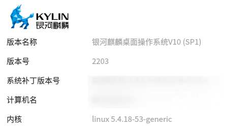
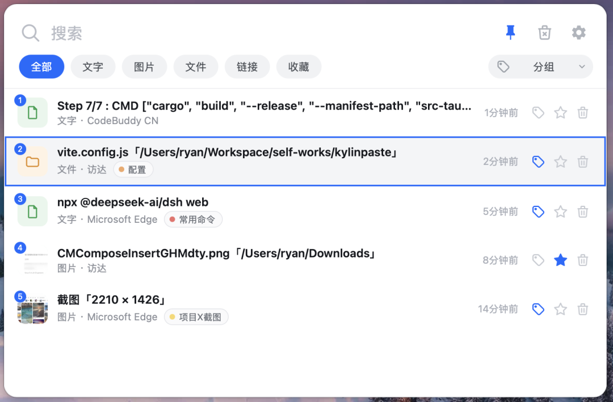

[](https://github.com/shuglx/kylinpaste/releases)
[](LICENSE)
[](https://github.com/shuglx/kylinpaste/releases)


一个为**银河麒麟操作系统**打造的轻量剪贴板管理工具，基于 Tauri（Rust + React）构建。

## 为什么做这个

企事业单位在信创国产化过程中，不少办公终端换成了银河麒麟OS + 国产 CPU（飞腾/鲲鹏等 ARM64 平台）上，桌面生态比较封闭：

- Windows 上成熟的剪贴板工具 (Ditto、ClipboardFusion等) 没有适配的 Linux/ARM64 版本；Linux 侧通用的方案（CopyQ、GPaste）在麒麟上要么缺依赖、要么对低版本 WebKitGTK/UKUI 桌面兼容不佳;
- 办公中最常用的"复制 → 找历史 → 再粘贴"这件事，恰恰是信创环境里体验缺口最大的。

KylinPaste 因此而生：**按麒麟的目标环境反推技术选型**——以麒麟 V10 SP1 自带的 WebKitGTK 2.28 基线构建，UI 与交互按国产桌面（UKUI）的真实问题逐一适配，同时提供 macOS 版本方便开发预览。

参考运行目标（银河麒麟桌面操作系统 V10）：



## 功能特性

- **全局快捷键**：`Ctrl+Shift+V`（macOS `⌘⇧V`）随时呼出/隐藏，可在设置中改绑
- **自动捕获**：文字、富文本（HTML）、图片、文件、链接自动识别并分类
- **来源应用**：每条记录显示"类型 · 来源应用"，一眼知道内容从哪复制
- **搜索与筛选**：全文搜索 + 分类筛选（全部/文字/图片/文件/链接/收藏）+ 分组筛选
- **分组与收藏**：分组彩色标签（mac 标签同款 7 色）、收藏置顶保护，均不占保留上限
- **键盘友好**：`↑/↓` 选记录、`回车` 粘贴，`Alt/⌥ + 1~9` 快捷粘贴前 9 条
- **安全清理**：一键清理临时记录，收藏与分组永不误删；受保护记录删除前二次确认
- **粘贴还原**：富文本写回时同时携带 HTML 与纯文本，富文本/纯文本目标都能粘
- **数据本地化**：所有数据仅存本机（记录/设置均为应用目录下的 JSON），无任何网络传输
- **中英双语**、亮色轻量界面、开机自启、置顶图钉

## 界面预览



## 使用方法

| 快捷键 | 功能 |
| --- | --- |
| `Ctrl+Shift+V`（macOS `⌘⇧V`） | 呼出 / 隐藏主窗口（可在设置改绑） |
| `Alt/⌥ + 1~9` | 快速粘贴前 9 条记录（可在设置关闭"便捷粘贴"） |
| `↑` / `↓` | 在记录间移动选择 |
| `回车` | 粘贴当前选中的记录 |
| `Esc` | 收起窗口 |

鼠标操作：点击条目直接粘贴；条目尾部三个按钮分别是**分组、收藏、删除**；顶部图钉为置顶、扫帚图标为清理临时记录、齿轮进入设置。

设置页提供：常规（开机自启、便捷粘贴、快捷键改绑、界面语言）、存储（容量限制、当前占用、记录/设置/日志文件直达）、关于。

## 安装

从 [Releases](https://github.com/shuglx/kylinpaste/releases) 下载对应平台的包：

**银河麒麟 / Ubuntu（ARM64）**

```bash
sudo dpkg -i kylinpaste_0.2.8_arm64.deb
# 依赖 WebKitGTK 4.1(麒麟 V10 SP1 自带),如缺依赖可执行: sudo apt -f install
```

**macOS（Apple Silicon）**

1. 打开 `KylinPaste_x.y.z_aarch64.dmg`，拖入「应用程序」；
2. 首次运行：右键 → 打开（应用未签名）；
3. 粘贴功能需在 系统设置 → 隐私与安全性 → 辅助功能 中授权。

## 从源码构建

```bash
npm install
npm run tauri:dev      # 开发调试
npm run tauri:build    # 本地出包
```

> Linux 构建基于 Ubuntu 20.04(focal) 容器（`docker/Dockerfile.build`），将 webkit2gtk 锁定在
> 2.28.1 与麒麟机的 glibc/WebKitGTK 基线对齐，保证产物在目标机可直接运行；CI 会同时产出 deb 与 dmg。

## 数据与隐私

- 记录保存在 `<用户数据目录>/history.json`，设置在 `settings.json`，全部仅存本机；
- 收藏与分组的记录不占保留上限、也不会被清理功能误删；
- 应用无任何网络传输功能。

## 许可

[MIT](LICENSE)
